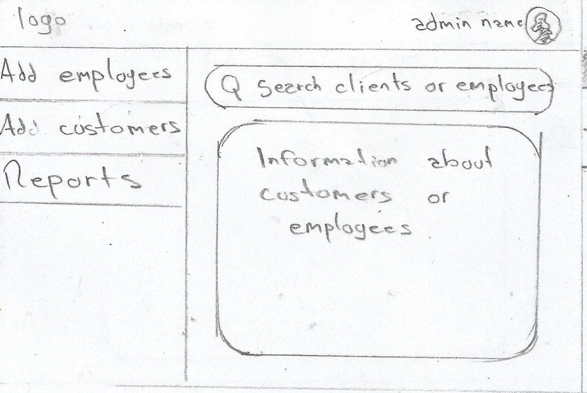
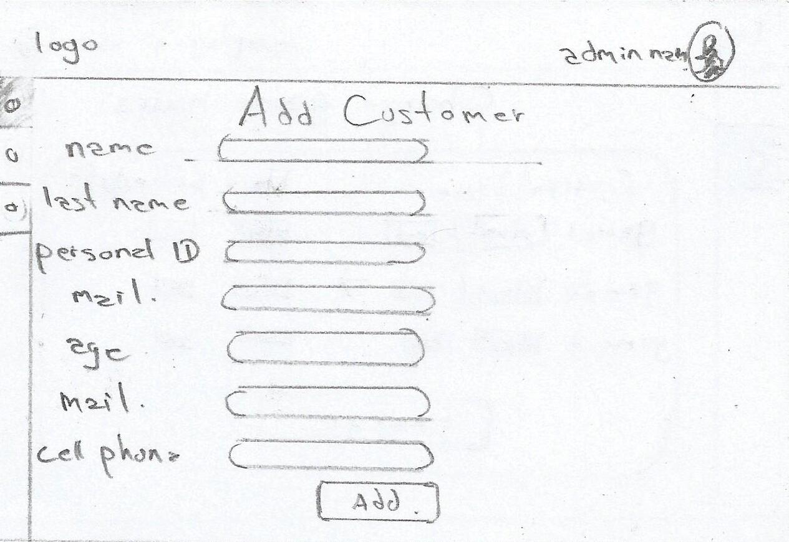
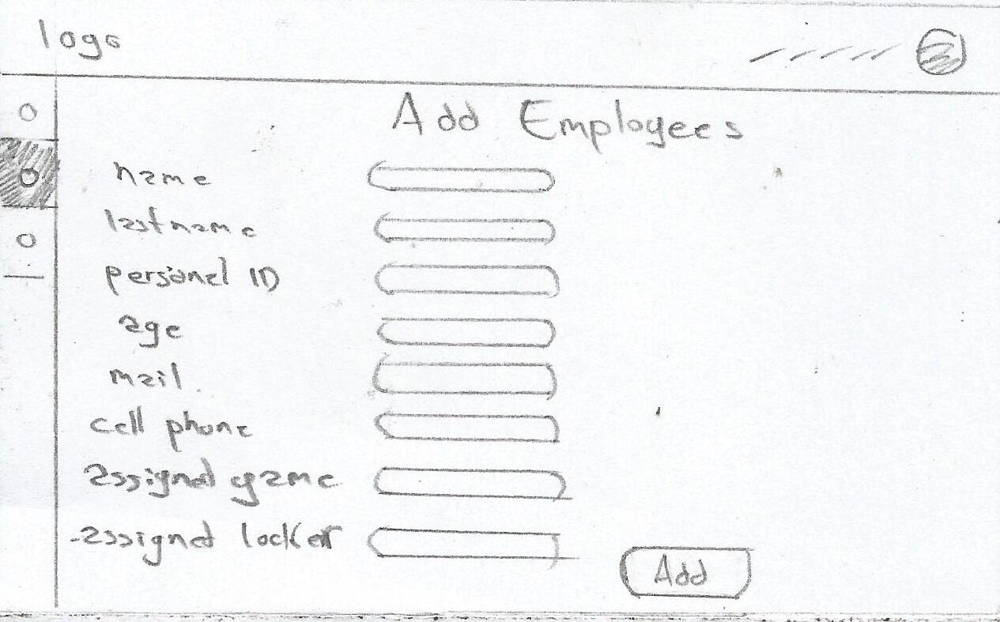
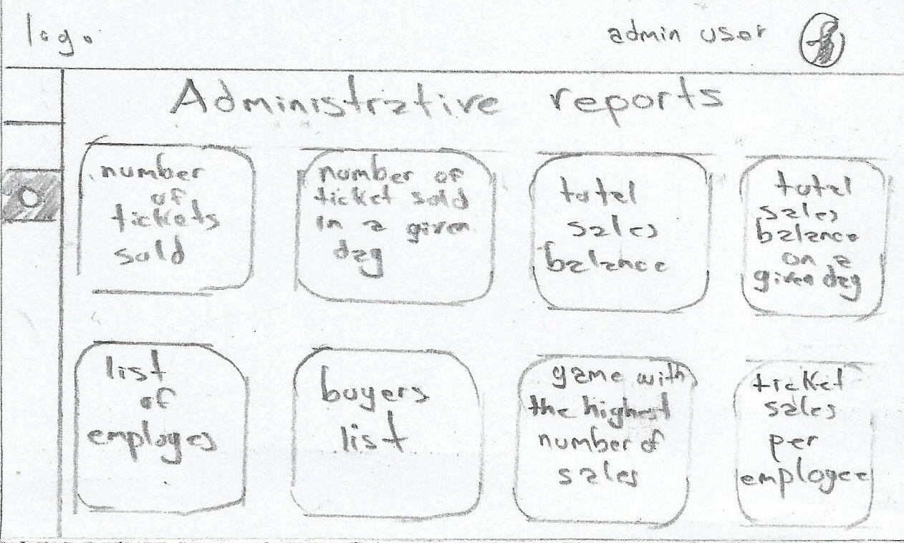
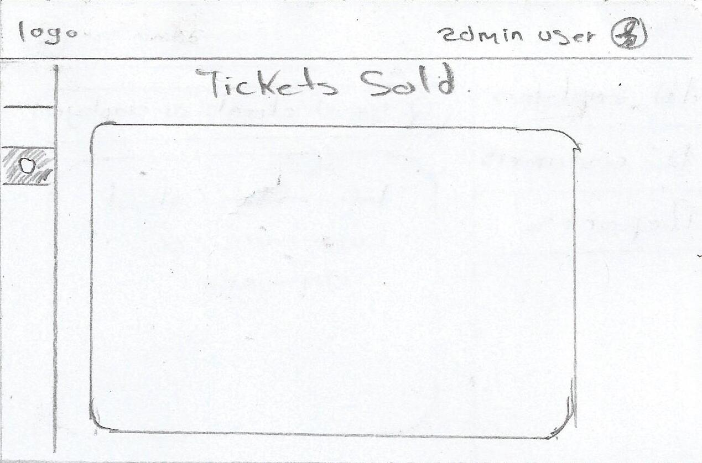
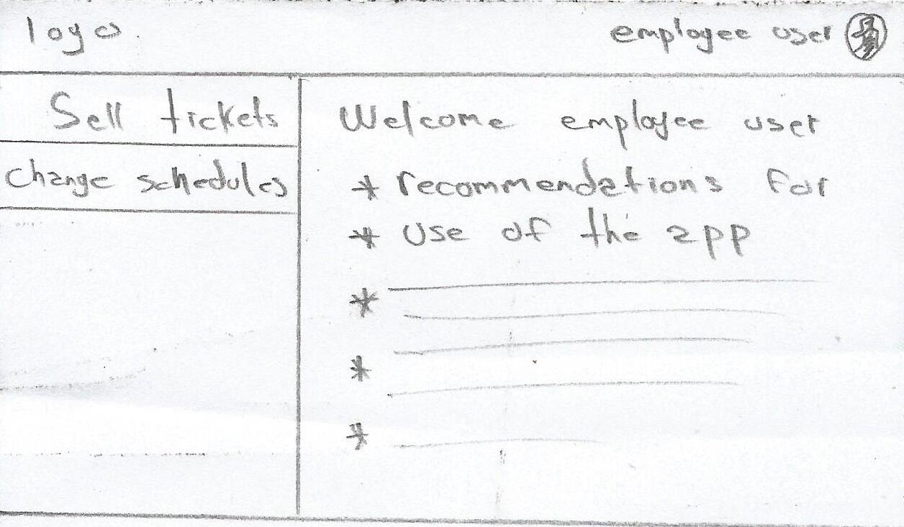
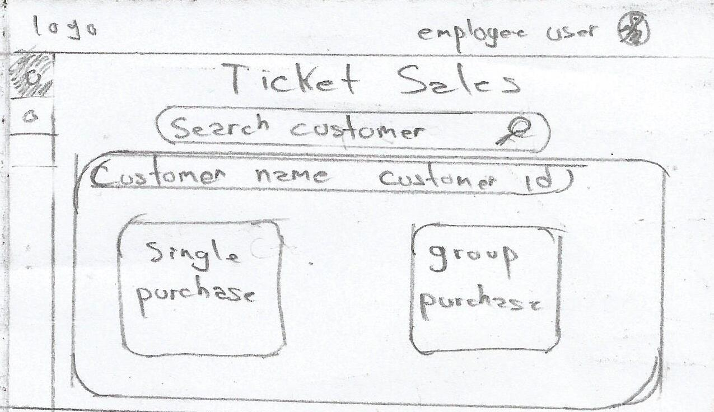
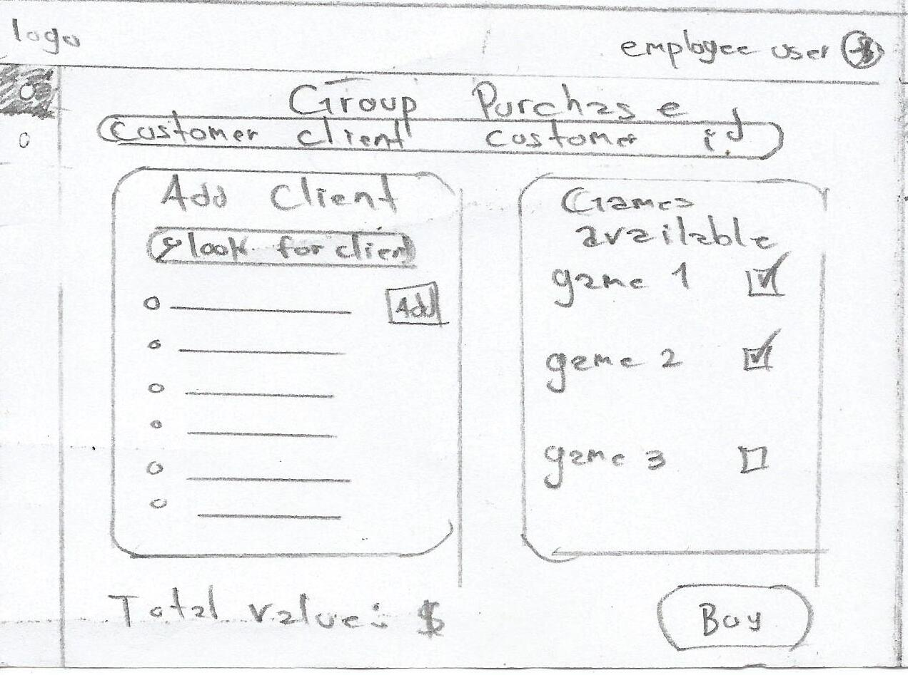
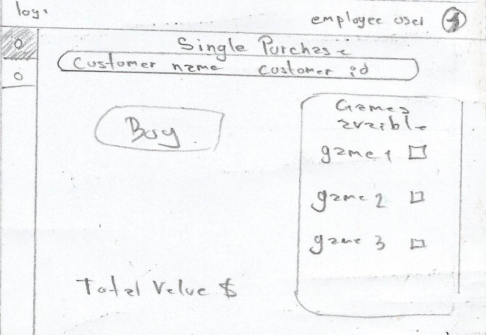
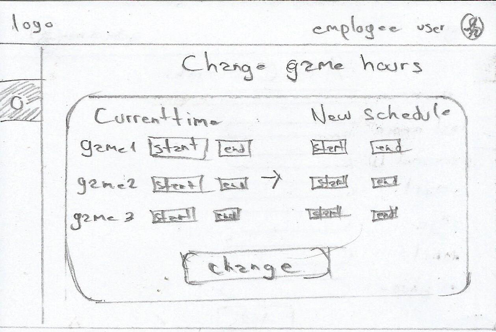

# Requerimientos de la interfaz

El proyecto simula un sistema que se utilizaría hipotéticamente dentro de las instalaciones del parque de diversiones, es decir solo sería usado por el personal que esta dentro del parque.

## Interfaz inicial del sistema del parque de diversiones

Es la página inicial que ven los empleados ya sea administrativos o funcionario de juegos. Consta del diseño general del parque (pensando que es una marca que tiene colores específicos) en donde se mostrarán dos botones para:

- Ingreso de administrativos
- Ingreso de empleados
- Opción de recuperar contraseña

## Interfaz para el empleado administrativo

El empleado administrativo es el encargado de registrar a los clientes que ingresan en el parque, hipotéticamente este proceso se llevaría a cabo cuándo los clientes pasan por la entrada principal del parque. En esta interfaz se deben registrar a los clientes del parque y también a los empleados que operan las taquillas de venta de tickets de los juegos.

### Inicio de sesión del empleado administrativo

Consta de un formulario de usuario y contraseña para que el empleado administrativo comience labores.

### Dashboard administrativo

### Panel de registro de clientes

En este panel se solicitarán los datos personales de cada cliente como nombres y apellidos, correo electrónico, número de documento de identificación y teléfono celular.
Una vez colocados los datos se tendrá un botón de agregar cliente con el cual el cliente quedará registrado.

### Panel de registro de empleados

En este panel se registrarán los datos de cada empleado como nombres y apellidos, documento de identificación y id de empleado en la empresa. También en este panel se le asignará el juego que administrara el empleado.

### Panel de eliminación de clientes que se deseen retirar del sistema

Este panel constará de una interfaz de búsqueda para ubicar y eliminar clientes del sistema.

### Panel de eliminación de empleados que se deseen retirar del sistema

Este panel constará de una interfaz de búsqueda para ubicar y eliminar empleados del sistema.

### Reportes administrativos

El administrador tendrá un panel en el cual podrá realizar reportes estadísticos de las ventas de los tickets, compradores, empleados y clientes. Además de otras estadísticas del parque.

### Ejemplo reporte de tickets vendidos

## Interfaz para el empleado de taquilla de venta de tickets por juego

El empleado de juegos es el encargado de la venta de tickets y la administración de los horarios del juego asignado.

### Inicio de sesión del empleado de juegos

Consta de un formulario de usuario y contraseña para que el empleado administrativo comience labores.

### Dashboard empleado

En esta página se podrían añadir indicaciones a el empleado(a) para el uso adecuado de la aplicación.

### Panel de venta de tickets

En esta interfaz el empleado podrá buscar y ubicar a los clientes ya registrados en el sistema y los horarios del juegos asignados a ese punto de venta (se supone que hipotéticamente hay varias taquillas de venta y cada taquilla tiene un empleado asignado con juegos diferentes).

### Proceso de venta

Una vez ubicado el cliente que realizara la compra pueden ocurrir dos escenarios, el comprador quiere realizar una compra individual o una compra grupal varias entradas para otras personas.

### Compra grupal

En la compra grupal se tendrá un espacio especial en la interfaz para el comprados y otro panel para los clientes asociados a esta compra, del juego seleccionado.

### Compra individual

La interfaz simplemente determinará el número de entradas a comprar en los juegos seleccionados.

### Horarios de juegos

Se debe mostrar en la interfaz de alguna manera que juegos están activos y que juegos están inactivos por tema de horarios.

### Cambio de horarios en los juegos

El empleado asignado en determinados juegos tendrá un panel administrativo para modificar el horario de los juegos en un día en particular, teniendo la opción de seleccionar los horarios en los juegos que fueron asignados a este empleado.
